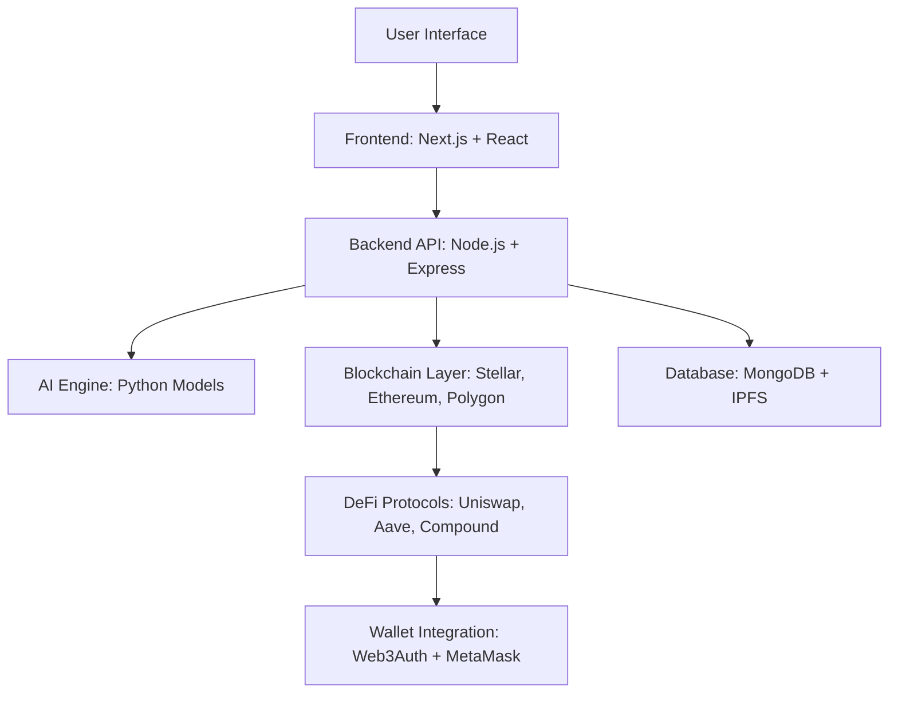

<a id="readme-top"></a>

<!-- PROJECT TITLE -->
<h1 align="center">🚀 XyraFin (AI-Powered DeFi Wealth Management Platform) 💹</h1>

<p align="center">
  <strong>XyraFin helps users manage, invest, and grow their crypto wealth using AI-driven financial intelligence.</strong>  
</p>

---

## 📌 Table of Contents
<details>
  <summary>Click to Expand</summary>
  <ol>
    <li><a href="#overview">🌟 Overview</a></li>
    <li><a href="#features">✨ Key Features</a></li>
    <li><a href="#tech-stack">🛠️ Tech Stack</a></li>
    <li><a href="#project-architecture">🏗️ Project Architecture</a></li>
    <li><a href="#installation">⚡ Installation & Quick Start</a></li>
    <li><a href="#future-scope">🔮 Future Scope</a></li>
    <li><a href="#license">📜 License</a></li>
  </ol>
</details>

---

<a id="overview"></a>
## 🌟 Overview

**XyraFin** is an **AI-powered decentralized finance (DeFi) platform** that simplifies crypto portfolio management and investment decisions.  
It integrates **machine learning, predictive analytics, and blockchain interoperability** to provide users with **personalized investment strategies** and **real-time portfolio tracking**.

💡 **Problem XyraFin Solves**  
Managing crypto assets across multiple blockchains can be **complex**, **risky**, and **time-consuming**. XyraFin leverages **AI + DeFi** to make financial management smarter, faster, and safer.

---

<a id="features"></a>
## ✨ Key Features

- 🤖 **AI-Powered Investment Recommendations** - Personalized strategies based on real-time market data.
- 📊 **Crypto Portfolio Dashboard** - Unified view of all your crypto assets across blockchains.
- 🔗 **Multi-Chain Support** - Seamlessly integrates with **Stellar**, **Ethereum**, **Polygon**, and more.
- 🛡️ **Secure Wallet Integration** - Non-custodial wallet connection with full user control.
- 📈 **DeFi Yield Optimization** - Automatically finds the **best staking and liquidity pools**.
- 🔒 **Privacy First** - Zero-knowledge encryption for user data and wallet security.

---

<a id="tech-stack"></a>
## 🛠️ Tech Stack

| Layer             | Technology Used |
| ----------------- | ---------------- |
| **Frontend**      | React.js, Next.js, Tailwind CSS |
| **Backend**       | Node.js, Express.js |
| **Blockchain**    | Stellar, Ethereum, Polygon |
| **AI/ML Engine**  | Python (TensorFlow, scikit-learn, Prophet) |
| **Database**      | MongoDB + IPFS (for decentralized storage) |
| **Auth**          | Web3Auth, MetaMask, WalletConnect |

---

<a id="project-architecture"></a>
## 🏗️ Project Architecture



---

<a id="installation"></a>

## ⚡ Installation & Quick Start

Follow these steps to set up **XyraFin** locally and start building, deploying, and testing your AI-powered DeFi portfolio optimizer.


### **1. Prerequisites**
Make sure you have the following installed:

- [Rust](https://www.rust-lang.org/) *(for Soroban smart contracts)*
- [Cargo](https://doc.rust-lang.org/cargo/)
- [Node.js](https://nodejs.org/) >= 18
- [pnpm](https://pnpm.io/) *(or use npm)*
- [Python](https://www.python.org/) >= 3.10 *(for AI agent)*
- [MongoDB](https://www.mongodb.com/) *(database)*
- [Freighter Wallet](https://www.freighter.app/) *(for Soroban testnet transactions)*


### **2. Build & Deploy Smart Contract (Testnet)**

```bash
cd smart-contracts/loans
cargo build --target wasm32-unknown-unknown --release
```

### **3. Deploy the Contract**

```bash
soroban contract deploy \
  --wasm target/wasm32-unknown-unknown/release/loans.wasm \
  --network testnet
```
- Copy the generated **CONTRACT_ID** as you'll need it for the frontend setup.


### **4. Run the AI Backend**

```bash
cd backend
pnpm install   # or npm install
pnpm dev       # or npm run dev
```
- 🖥️ Backend runs on: ```http://localhost:8787```


### **5. Set Up the Frontend**

#### 5.1 Add the Contract ID

```bash
frontend/src/lib/soroban.ts
```
- Paste your CONTRACT_ID into the file.

#### 5.2 Install Dependencies & Start Frontend

```bash
cd frontend
pnpm install   # or npm install
pnpm dev       # or npm run dev
```
- 🌐 Frontend runs on: ```http://localhost:3000```


### **6. Using the App**

1. Open the frontend in your browser.
2. Connect your **Freighter Wallet** to the testnet.
3. Run AI-powered portfolio checks.
4. Use loan actions, manage assets, and test DeFi flows.


### **7. Important Note for Soroban Integration**

Currently, the **frontend Soroban invoke** is **stubbed** to keep the project lightweight.

For a **fully functional on-chain demo**:

1. **Replace the stub** in:  
   ```bash
   src/lib/soroban.ts
   ```

2. Use real Soroban JS SDK calls:
- ```footprintPreflight```
- ```invokeContract```

3. Follow the Soroban Official Client Docs for proper integration.
- The UI, wiring, and flows are already in place, making the integration fast and seamless.


---

<a id="future-scope"></a>
## 🔮 Future Scope

- 🌐 **Support for More Blockchains** - Integrate Solana, Avalanche, Cosmos, and more.
- 🧠 **Generative AI-powered Financial Planning** - Advanced portfolio optimization using AI.
- 📲 **Mobile App for Android & iOS** - Cross-platform mobile support for on-the-go access.
- 🔐 **Zero-Knowledge Wallet Privacy Layer** - Enhanced privacy with ZK proofs.
- 🕸️ **DAO Governance Module** - Community-driven decision-making and voting mechanisms.

---

<a id="license"></a>
## 📜 License

Distributed under the BSD-3 Clause License.
<p align="center"> ⚡ Built by <a href="https://github.com/sanaysarthak">Sarthak Sanay</a> | © 2025 <b>XyraFin</b> 🌌 </p>
